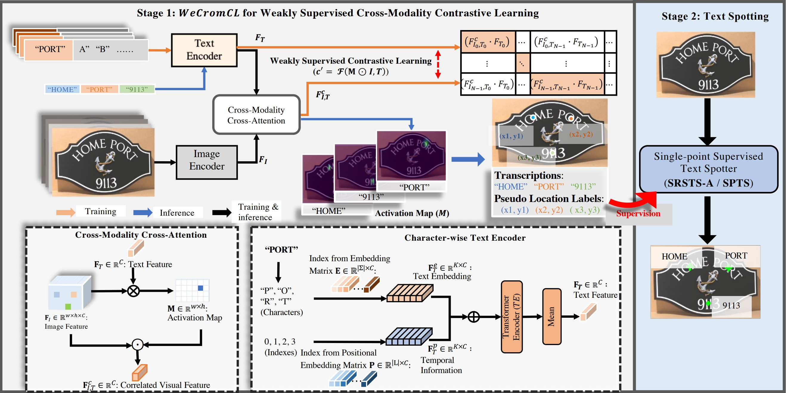

# WeCromCL: Weakly Supervised Cross-Modality Contrastive Learning for Transcription-only Supervised Text Spotting

The checkpoint can be download from [BaiduNetDisk](https://pan.baidu.com/s/1LdpX8rGu_tyWfHUmE79hlg?pwd=3cq5) (password:3cq5). 
## To do
- Update the inference file.
- Update the evaluation metrics.
- Upload the training datasets.

## Environment

## Stage1
### Datasets

### Inference
First modify ```data.test.img_rootdir``` and ```data.test.annotation_files``` in ```configs/finetune/ic15.yaml``` to your actual path, then run
```
python inference.py --config configs/finetune/ic15.yaml --resume /path/to/ckpt
```
to get the result of inference at ```inference```. You can also set ```inference.vis=True``` in config files if you want to visualize the results.

### Evaluation

### Training
#### Pretrain
First modify ```data.train.annotation_files``` and ```data.train.img_rootdir``` in ```configs/pretrain/pretrain.yaml``` to your actual path, then run
```
python train.py --config configs/pretrain/pretrain.yaml
```
to start training. The outputs will be written to ```outputs/xxx```.

#### Finetune
First modify ```data.train.annotation_files``` and ```data.train.img_rootdir``` in ```configs/finetune/ic15.yaml``` to your actual path, then run
```
python train.py --config configs/pretrain/pretrain.yaml --resume path/tp/pretrain_ckpt
```
to start training. The outputs will be written to ```outputs/xxx```.
## Stage2